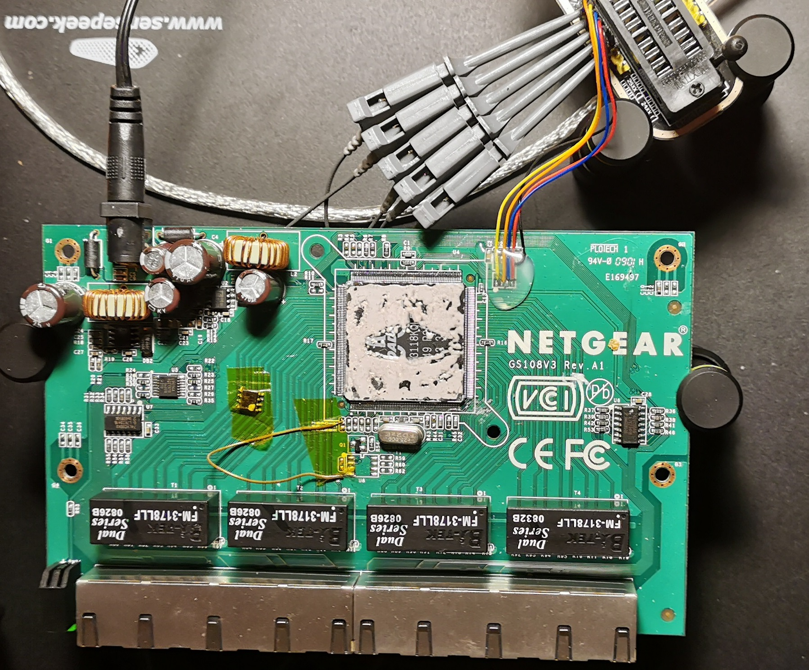

# Switcher
The goal is to use a slightly modified cheap external switch for fun and profit.

Since discovering the datasheet for the chipset within the my old Netgear 8 ports GB switch I am wondering if it would be possible to use the in for SPI and DSA (Distributed Switch Architecture) modules to control an external, originally unmanaged, switch.

## Why would you want this?
 * Use off-the-shelf low cost switches for serious traffic management on general purpouse hardware.
 * Create truly legacy free switching solutions:
    - Completely integrated within the Linux networking stack. 
    - Leverage existing kernel code for switch management and control.
    - Use the standard Linux networking tools for configuration.

This work uses a 15 Euro Netgear GS108v3 switch in combination with a 4 Euro ch341a USB to SPI adapter:



## Installation

### 1 Modify your switch
You will need to modify your switch in order to be able to control the registers.

Here you will find detailed instructions on how to connect a Netgear switches with an external USB-SPI device. The ch341a is recommended as a suitable kernel module is available.
 - [Netgear GS108-v3 bcm53118 based](/vendor/Netgear/GS108-v3/README.md)

### 2 Install the spi-ch341-usb kernel module

Kernel configuration:
```
Device Drivers  --->
    --- SPI support
        <M>   User mode SPI device driver support
    ...
    [*] Network device support  ---> 
        Distributed Switch Architecture drivers  ---> 
            <M> Broadcom BCM53xx managed switch support  --->
                <M> B53 SPI connected switch driver
```

Currently a USB-SPI device is not yet supported in mainline Linux. But luckily an sutable external kernel module exists.
Compile and install the out off tree kernel module https://github.com/dimich-dmb/spi-ch341-usb.git.

### 3 Test via SPIDEV on userspace 

(un)Load modules:
```
modprobe -r ch341 spi_ch341_usb
modprobe spi_ch341_usb
```

Bind the spidev driver:
```
sw="spidev"
dev="spi0.0"
echo $sw > /sys/class/spi_master/spi0/$dev/driver_override
echo $dev > /sys/bus/spi/drivers/$sw/bind
```

If everything went well you should see something like this in the logs:
```
dmesg | tail
[324470.788307] spi-ch341-usb 1-2:1.0: ch341_cfg_probe: output cs0 SPI slave with cs=0
[324470.788323] spi-ch341-usb 1-2:1.0: ch341_cfg_probe: output cs1 SPI slave with cs=1
[324470.788329] spi-ch341-usb 1-2:1.0: ch341_cfg_probe: output cs2 SPI slave with cs=2
[324470.788335] spi-ch341-usb 1-2:1.0: ch341_cfg_probe: input  gpio4 gpio=0 irq=0 (hwirq)
[324470.788343] spi-ch341-usb 1-2:1.0: ch341_cfg_probe: input  gpio5 gpio=1 irq=1
[324470.790357] spi-ch341-usb 1-2:1.0: ch341_spi_probe: SPI master connected to SPI bus 0
[324470.790412] spi-ch341-usb 1-2:1.0: ch341_spi_probe: SPI device /dev/spidev0.0 created
[324470.790535] spi-ch341-usb 1-2:1.0: ch341_spi_probe: SPI device /dev/spidev0.1 created
[324470.790609] spi-ch341-usb 1-2:1.0: ch341_spi_probe: SPI device /dev/spidev0.2 created
[324470.791828] spi-ch341-usb 1-2:1.0: ch341_usb_probe: connected
```

### 4 install the python spidev bindings:

```
pip install --user pyftdi
```

You should now be able to run some demo code [b53_spidev.py](src/python/b53_spidev.py) in oder to interact with the device.
```
 # ./b53_spidev.py
2.30 = 0x18
Device 0x53118 Revision 0x4
0x0 0x79 0x0
0x0 0x0 0x20
0x0 0x1 0x20
0x0 0x2 0x20
0x0 0x3 0x20
0x0 0x4 0x20
0x0 0x5 0x20
0x0 0x6 0x20
0x0 0x7 0x20
0x1 0x4 0x2aaaa
0x0 0xb 0x7
write 0x0 0xb 0x7 1
0x0 0xb 0x7
0x4 0x0 0x2
0x4 0x4 0x180c2000000
0x40 0x1 0xff
write 0x40 0x1 0xff 4
0x40 0x1 0xff
0x40 0x5 0x25f8
write 0x40 0x5 0x25f8 2
0x40 0x5 0x25f8
```

## TODO - DSA kernel support

In the end it would be nice to use the regular DSA drivers together with the regular networking userspace tools.


[[PATCH 1/2] net:dsa:b53: Add BCM53118 & fix SPI](src/kernel-patches/01.patch-net-dsa-b53_add-bcm53118.diff)

[[PATCH 2/2] net:dsa:b53: Add BCM53118 & fix SPI](src/kernel-patches/02.patch-net-dsa-b53_spi-sync.diff)

With these patches the DSA b53 code detects the switch:
```
modprobe -r ch341 b53_spi b53_common spi_ch341_usb
modprobe spi_ch341_usb
modprobe b53_spi

sw="b53-switch"
dev="spi0.0"

echo $sw > /sys/bus/spi/devices/$dev/driver_override
echo $dev > /sys/bus/spi/drivers/$sw/bind
```

The DSA driver detects the chip on the SPI bus:
```
[325560.840407] b53-switch spi0.0: found switch: BCM53118, rev 4
```

### TODO TODO TODO TODO TODO TODO:

But I have yet to find out how to bind a regular ethernet port to the b53-switch.


## External References

Below is a colllection of external references to similar projects:

 - [Hackaday RTL8366SB based](https://hackaday.com/2010/05/26/unlocking-the-crippled-potential-of-an-unmanaged-switch/)
 - [Hackaday IP178CH based](https://hackaday.com/2015/09/07/managing-an-unmanaged-switch/)
 - [Florian bcm53128 based](https://blog.n621.de/2019/04/vlans-on-the-netgear-gs108-switch/)
 - [Linuxehacking IP178CH based](http://linuxehacking.blogspot.com/2015/08/convert-your-unmanaged-to-vlan-capable.html) and [Hackaday](https://hackaday.io/project/7536-2-unmanaged-to-managed-l2-ethernet-switch-hack)
