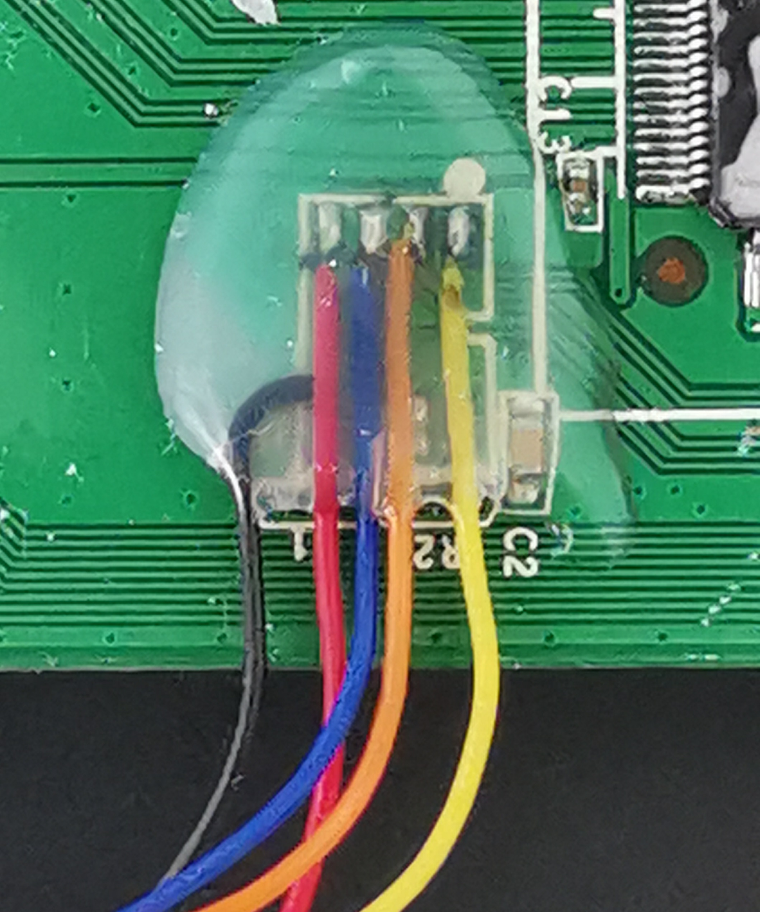

# Why

Step by step guide to control this switch via USB.

# How


## Hardware modifications
 1. Remove the resistor on CPU_EEPROM_SEL (pin 18 of SOC) in order to put the device in SPI mode.
 2. Remove the serial configuration EEPROM [Microchip 93C66A](https://ww1.microchip.com/downloads/en/DeviceDoc/21795E.pdf).
 3. Hookup the smd pads of the EEPROM footprint to a 3.3v compatible SPI device, see below.
   A FT232H or CH341a works perfectly well. I find the CH341A based devices easier to work due to the availability of an out of tree kernel module that compiles well on recent kernels. Also you will get close to the maximum SPI allowed spi frequency of 2 Mhz. 
 4. Optional: remove the resistor on HW_FWDG_EN (pin 9 of SOC) and pull to GND in order to disable forwarding in managed mode.



## Connections
```
  93C66A         FT232H    Wire color   CH341

  1  CS    -->   AD3 CS  -  yellow   -  2  CS
  2  CLK   -->   AD0 TCK -  orange   -  1  CLK
  3  DI    <--   AD1 DO  -  blue     -  3  MOSI
  4  DO    -->   AD2 DI  -  red      -  4  MISO
  5  GND   ---   GND     -  black    -  5  GND
  6  ORG
  7  nc
  8  3.3v
```

## Software

**FH232H based**
  1. Install the [udev](/src/99-ftdi-udev.conf) rules for the FT232H if needed.
  2. If you want to play around with the rudimentary python test code:
      * Install libusb 
      * Install pyftdi, example: `pip install --user pyftdi`
      * run `python b53.py` from [src](/src)
 
     And expect some output, should work with most Broadcom switch chipsets.

**CH341A based**
  1. Compile and install the out off tree kernel module https://github.com/dimich-dmb/spi-ch341-usb.git
  2. You may need to blacklist the ch341 module in order to prevent it from grabbing your chip, see chapter `Blacklisting` in https://wiki.archlinux.org/title/Kernel_module
  3. Your switch is now exposed via the [SPI userspace API](https://www.kernel.org/doc/html/latest/spi/spidev.html), for which a lot of bindings exist:
      * See [Python Spidev](https://pypi.org/project/spidev/)
      * and many others ...
     
  4. TODO patching the [b53_spi](https://git.kernel.org/pub/scm/linux/kernel/git/stable/linux.git/tree/drivers/net/dsa/b53/b53_spi.c) kernel module.
   The ultimate goal would be to interact with your device using standard tools like `ip` and `bridge`.

## Notes:
 - Datasheet with documentation on the registers can nowadays be found on the web for quite some Broadcom switch chipsets.
   Last time I checked: BCM53118 datasheet is at https://www.mouser.com/datasheet/2/678/broadcom_limited_avgo-s-a0007199329-1-1747631.pdf
 - Please visit [EEPROM Traces](eeprom_traces) if you are interested in the communication with the eeprom.
 - Most Broadcom switches are supported in Linux by the in-kernel DSA b53 driver.
   So if we can hook up the shitch via the kernel SPI bus we should be able to use the regular userspace tools like iproute and bridge to do the configuration.
   This makes this sort of hack more mainstream and usable, no legacy configuration tools are needed, all nicely within the linux networking stack.
   At the moment there is no in kernel SPI- support for the widely available USB interface modules, like FT?232H or ch341a chipsets.
   See also https://christian.amsuess.com/idea-incubator/ftdi-kernel-support/ on a deeper discussion.
 - There is also a patchset for a FT232H Linux SPI kernel module:
   - [Mailing List](https://lore.kernel.org/lkml/20190221202506.17744-3-agust@denx.de/)
   - [Denx Source Archive](https://source.denx.de/denx/fpga-cfg)
