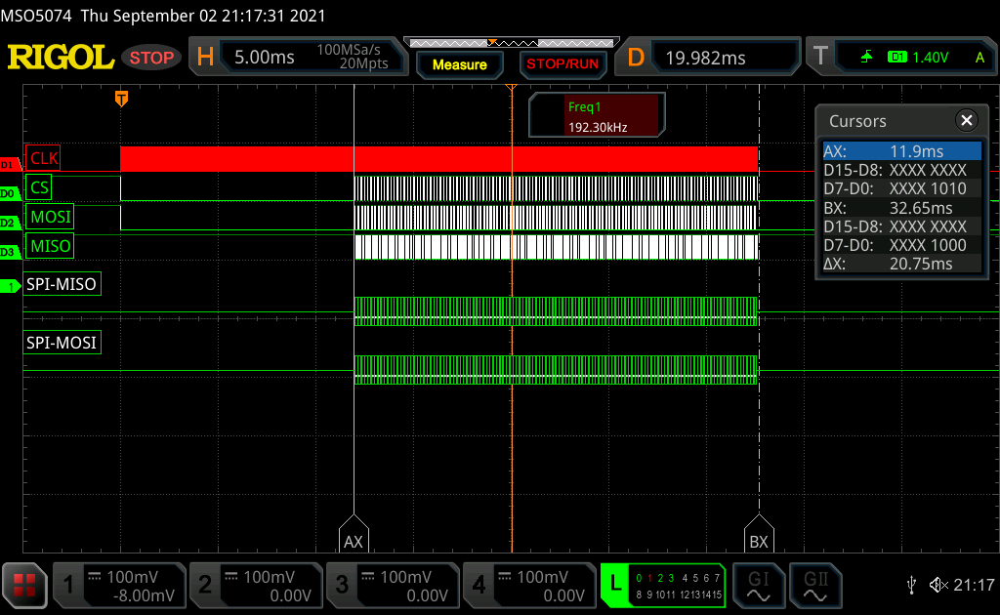
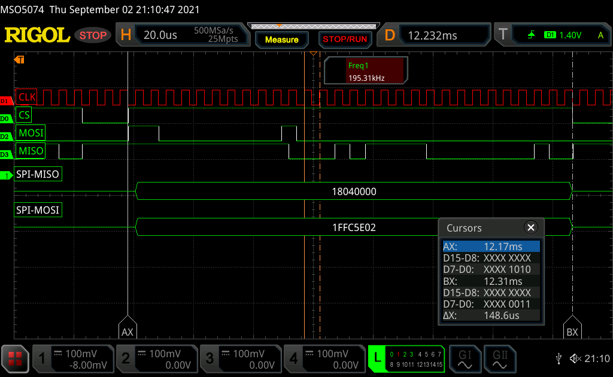

# EEPROM Traces

Prior to removing the EEPROM I captured the communication.

## Traces

 - The communication is available as a VCD file for study with tools like pulseview or sigrok.
 - In the csv-text file there is the decoded version. 

Below are screenshots of the captured waveforms.

